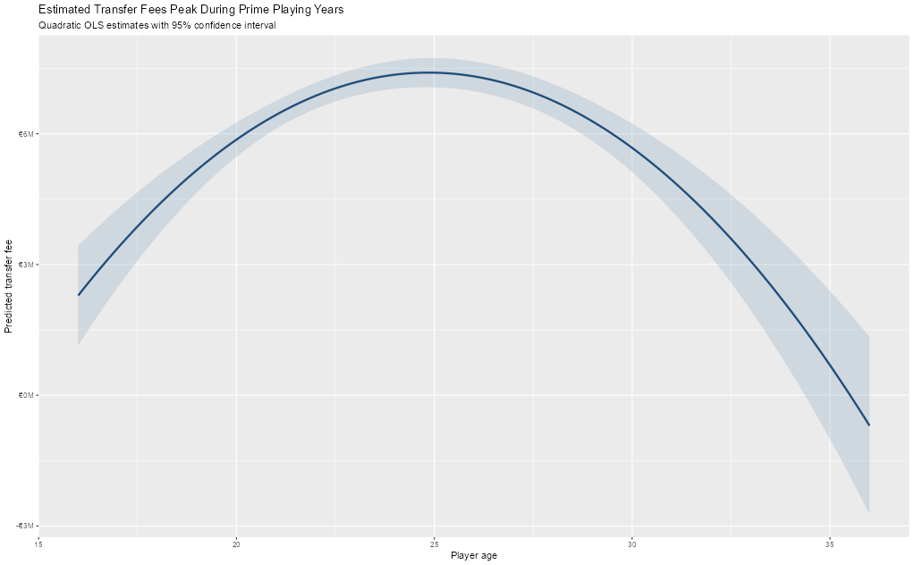
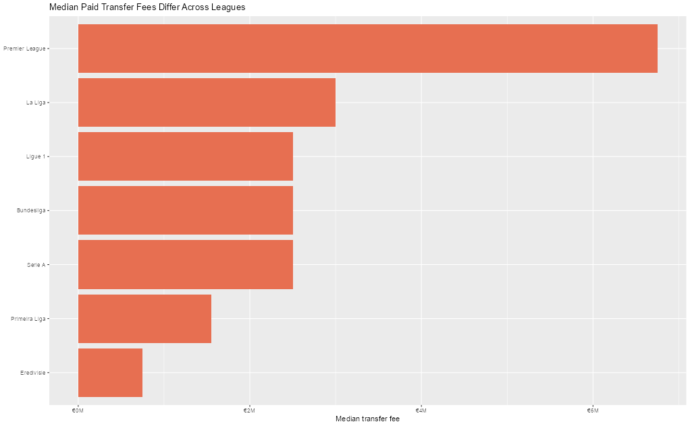
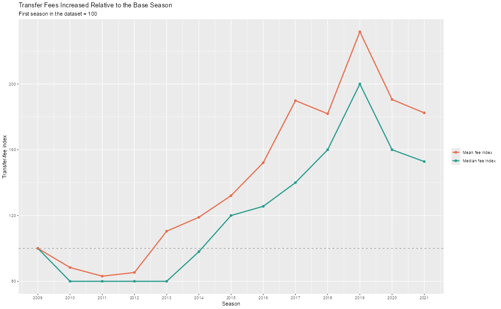
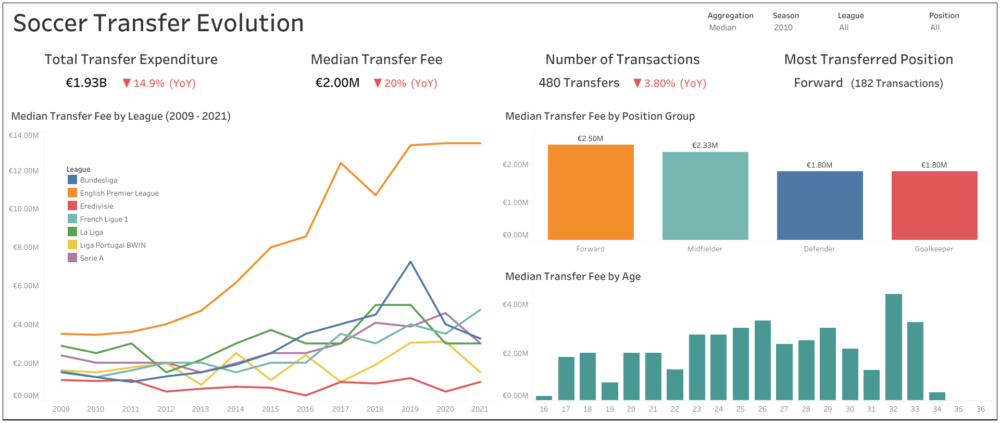

# European Football Transfer Market Analysis

> A reproducible sports analytics project examining transfer-fee inflation, league-level spending differences, and player-profile effects across seven major European football leagues from 2009 to 2021.

[](https://www.r-project.org/)
[](https://quarto.org/)
[](https://www.tableau.com/)

## Overview

European football transfer markets are shaped by club purchasing power, player characteristics, and changing market conditions. This project analyzes how paid transfer fees evolved across seven major European leagues from 2009 through 2021, and evaluates whether observed fees differ by league, player age, and playing position.

The project combines a reproducible R/Quarto workflow with an interactive Tableau dashboard. It turns **70,006 raw transfer records** into an analytical sample of **7,203 paid incoming transfers** by retaining comparable permanent acquisitions and excluding loans, loan-end records, retirements, free transfers, missing fees, implausible player ages, and values above €222M.

## Research questions

1. How did paid transfer fees evolve across leagues and seasons from 2009 to 2021?
2. Does player age have a linear or nonlinear relationship with transfer fee?
3. Did Premier League clubs pay a systematic premium relative to the other leagues in the dataset?
4. How do transfer fees vary by player position group?

## Key findings

| Finding | Evidence |
|---|---|
| **Long-run fee inflation** | Median fees increased from €2.50M in 2009 to €3.82M in 2021; mean fees increased from €4.55M to €8.30M. Both measures peaked in 2019 and declined in 2020–2021, indicating long-run inflation with year-to-year volatility. |
| **Premier League premium** | The Premier League had the highest estimated mean fee (€11.75M) and median fee (€6.75M). All other league coefficients were negative and statistically significant relative to the Premier League ($p < .001$). |
| **Nonlinear age effect** | Age had no significant linear association with fee ($r = 0.0090$, $p = 0.443$), but a quadratic model significantly improved fit ($F(1,7200) = 65.46$, $p < .001$). Predicted fees peak at approximately 24.9 years. |
| **Position-based pricing** | Forwards had the highest median fee (€3.40M), followed by midfielders (€3.00M), defenders (€2.50M), and goalkeepers (€1.95M). |

## Featured visualizations

### Transfer fees peak near prime age



The fitted quadratic model indicates that expected transfer fees peak at approximately age 24.9. Age alone explains a limited portion of fee variation, but the curved relationship is statistically significant and more informative than a linear-only model.

### Premier League transfer-fee premium



The Premier League had the highest typical paid transfer fee in the study period. League-specific benchmarks are therefore more useful than a single cross-Europe transfer-fee average.

### Long-run transfer-fee inflation



Both mean and median fees rose materially relative to the 2009 baseline, with a visible 2019 peak followed by declines in 2020 and 2021. The larger increase in mean fees shows the influence of high-value transactions on average market cost.

## Tableau dashboard

The interactive dashboard supports filtering by aggregation method, season, league, and position group. It includes KPI cards for total transfer expenditure, transfer fee, number of transactions, and most-transferred position, as well as visual views of fee trends by league, position group, and player age.



- [Dashboard documentation and workbook access](tableau/tableau_dashboard_link.md)
- [Download the Tableau Packaged Workbook](tableau/european_transfer_market_dashboard.twbx)
- [Open the interactive Tableau dashboard](https://public.tableau.com/views/SoccerTransferEvolution/Dashboard1?:language=en-US&:sid=&:redirect=auth&:display_count=n&:origin=viz_share_link)

## Methods

### Data preparation

The cleaning workflow retains records that meet the following criteria:

- Incoming transfers (`dir == "in"`), representing the acquiring club's perspective.
- Permanent, non-retirement transactions; loans and loan-end records are excluded.
- Players aged 16–40.
- Positive, non-missing transfer fees.
- Transfer fees at or below €222M.

Detailed player positions are grouped into **Forward**, **Midfielder**, **Defender**, and **Goalkeeper**. Transfer windows are standardized as Summer and Winter, and a derived timing field supports seasonal analysis.

### Statistical analysis

| Question | Method |
|---|---|
| Linear age-fee relationship | Pearson correlation test |
| Nonlinear age-fee relationship | Linear and quadratic OLS models; ANOVA model comparison |
| League-level price differences | OLS regression with Premier League as reference group |
| Fee inflation over time | Mean and median seasonal indices; year-over-year change; linear and log-linear time-trend models |

## Repository structure

```text
european-football-transfer-market-analysis/
├── README.md
├── EXECUTIVE_SUMMARY.md
├── .gitignore
├── notebooks/
│   └── transfer_market_analysis.qmd
├── data/
│   ├── raw/
│   │   └── football_transfers_2009_2021.csv
│   └── processed/
│       ├── paid_incoming_transfers_clean.csv
│       └── transfer_fee_inflation_index.csv
├── tableau/
│   ├── european_transfer_market_dashboard.twbx
│   ├── dashboard_preview.png
│   └── tableau_dashboard_link.md
└── figures/
    ├── age_fee_relationship.png
    ├── league_fee_comparison.png
    └── transfer_fee_inflation_index.png
```

> The raw Kaggle source file is intentionally excluded from version control. Download it separately and save it as `data/raw/football_transfers_2009_2021.csv` before rendering the analysis.

## Reproduce the analysis

### Requirements

- R 4.2 or later recommended
- RStudio, Positron, or another R-compatible editor
- Quarto
- Tableau Public or Tableau Desktop for the dashboard

### R packages

```r
install.packages(c(
  "tidyverse",
  "janitor",
  "skimr",
  "zoo",
  "scales",
  "broom",
  "here"
))
```

### Steps

1. Download the [Football Transfer Dataset from Kaggle](https://www.kaggle.com/datasets/mexwell/football-transfer-dataset).
2. Save the source file as `data/raw/football_transfers_2009_2021.csv`.
3. Open the repository as an R project or set the working directory to the repository root.
4. Render the report:

```bash
quarto render analysis/transfer_market_analysis.qmd
```

5. The report generates or refreshes:

```text
data/processed/paid_incoming_transfers_clean.csv
data/processed/transfer_fee_inflation_index.csv
```

6. Open `tableau/european_transfer_market_dashboard.twbx` in Tableau and refresh the data connections if required.

## Limitations

- The analysis covers seven European leagues and the 2009–2021 period only.
- It does not directly control for player quality, performance, contracts, wages, club finances, negotiation context, or tactical fit.
- Results describe paid incoming transfers only; free transfers, loans, retirements, missing-fee records, and fees above €222M are excluded.
- Transfer fees are highly right-skewed, so mean-based results are sensitive to elite, high-value transactions.
- The results are descriptive market benchmarks and should complement, not replace, player-level scouting and valuation models.

## Project materials

- [Executive summary](EXECUTIVE_SUMMARY.md)
- [Reproducible Quarto analysis](notebooks/transfer_market_analysis.qmd)
- [Processed transfer-level data](data/processed/paid_incoming_transfers_clean.csv)
- [Seasonal fee inflation index](data/processed/transfer_fee_inflation_index.csv)
- [Tableau dashboard information](tableau/tableau_dashboard_link.md)

## Data source and acknowledgment

Data were obtained from the [Football Transfer Dataset on Kaggle](https://www.kaggle.com/datasets/mexwell/football-transfer-dataset). This repository presents an individual portfolio adaptation of a collaborative academic Business Intelligence project.
